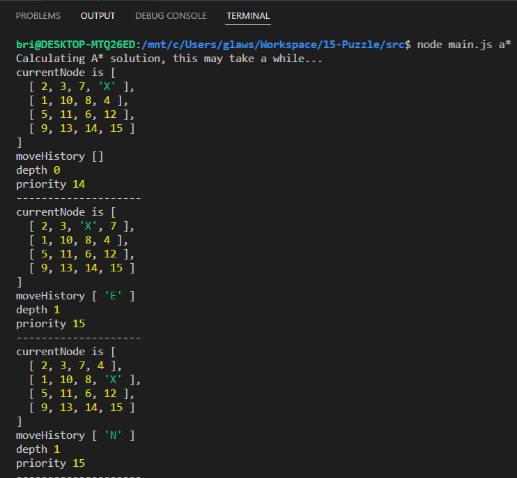
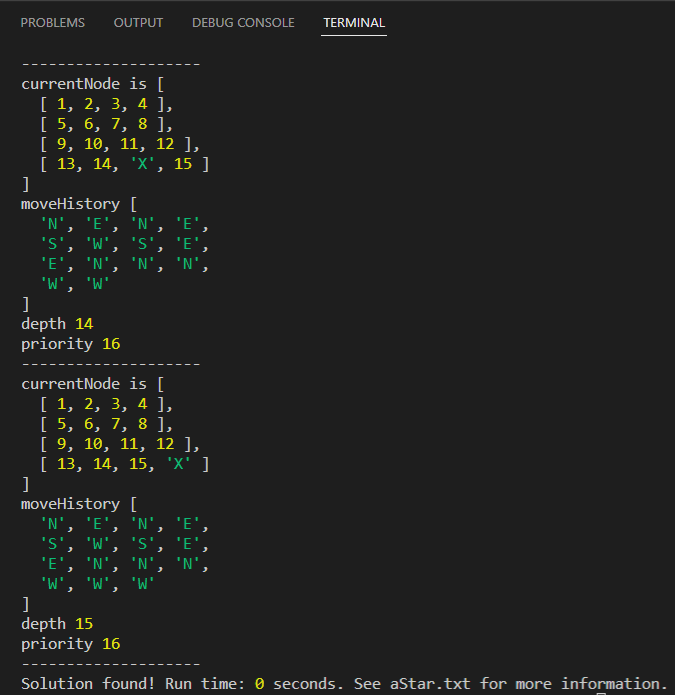
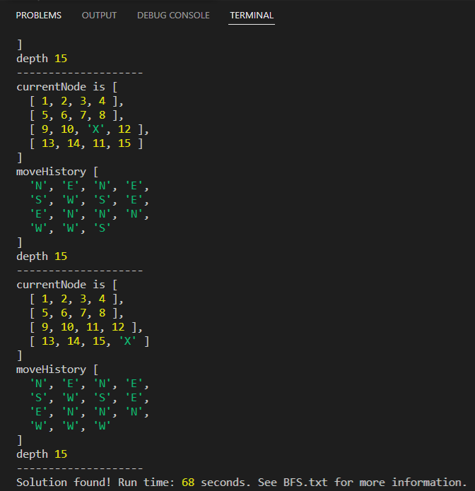
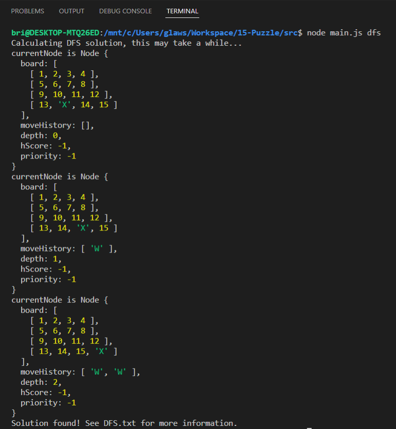

# 15-Puzzle
My implementations of a few search algorithms for solving a 15-Puzzle

## How to run
to select algorithm you would like to use for solving the puzzle, pass it as an argument to main.js

Example:
```sh
$ git clone https://github.com/Bglaws/Chess
$ cd 15-Puzzle/src
$ node main.js bfs
```
BFS and A* are both passed the same puzzle in main to demonstrate how much more efficient A* is than BFS.
DFS is given its own puzzle to solve. You will likely have to run DFS a few times before it finds the solution.
This is because DFS selects neighboring nodes at random, so it can easily "miss" the solution and search down the wrong path until you get a stack overflow

For anyone looking to create their own puzzle, keep in mind:

None of the algorithms I implemented are capable of solving a randomized puzzle (unless you get lucky and the randomized board is close to solution, very unlikely).
If you want to make your own puzzle I suggest back tracking from a solved position, keeping track of the number of moves you have made.
For DFS, the further the solution is, the more likely DFS will miss it and look down the wrong path. 

### Pictures







